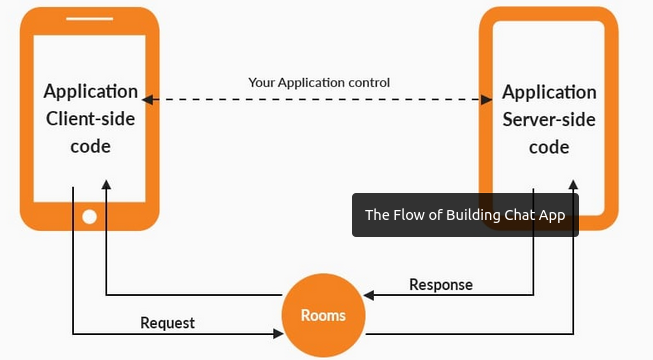

<h1 align="center">
    <a href="#" alt="">Chat em tempo real</a>
</h1>

<h4 align="center">
	🚧 finalizado 🚧
</h4>

<p align="center">
 <a href="#sobre-o-projeto">Sobre o projeto</a> •
 <a href="#funcionalidades">Funcionalidades</a> • 
 <a href="#layout">Layout</a> • 
 <a href="#como-executar-o-projeto">Como executar o projeto</a> • 
 <a href="#pré-requisitos">Pré-requisitos</a> •
 <a href="#rodando-o-projeto">Rodando o projeto</a> •
 <a href="#tecnologias">Tecnologias</a> •
 <a href="#anexos">Anexos</a>
</p>

## Sobre o projeto
Desenvolver uma aplicação web que seja capaz de funcionar como um chat aberto, o usuário precisa inserir uma identificação nome, email e data de nascimento. Ou seja um chat com variás salas e com usuários se comunicando em tempo real

### Funcionalidades e requesitos do projeto 

- [x] chat em tempo real
- [x] back-end em node.js
- [x] front-end em react
- [x] uso do design pattern observer
- [x] entrada de user somente com email diferente no mesmo chat
- [x] usuário deverá visualizar novas mensagens enviadas
- [x] usuário alertado quando outro usuário entrar/ou sair da sala
- [x] estrutura onde é possível ter vários chats/salas
- [x] chat em tempo realmpo real
- [x] chat representa uma url na aplicação.

---
## Layout

O layout da aplicação:

<p align="center" style="display: flex; align-items: flex-start; justify-content: center;">
  
</p>

---
## Como executar o projeto
    - Seguir o 'README.md' primeiro pasta back-end, em seguida o 'README.md' pasta front-end 
### Pré-requisitos
    - ter ide para codificar
    - noções de node
    - browser ou postman
    - noções de react
    - noções de git
    - noções de clear code
    - noções de design pattern

### Rodando o projeto

```bash

- Como dito acima é necessário estar primeiro com back-end ok, 
 em seguida do front-end ok
- Cada um contém um 'README.md' como esse explicando como esse,
 para colocar a sua parte do projeto e assim com as duas partes ok e 
 sem erros o projeto iniciará 
- No 'README.md' do front-end, contém também uma explicação para iniciar,
 uma converva usando o chat

```

---
## Tecnologias do projeto

As principais foram usadas na construção do projeto:
 
```bash
    "react": "^18.2.0", //front-end da aplicação
    "dotenv": "^16.0.3", //lida com variavel de ambiente
    "express": "~4.18.2", //criar um servidor http
    "node": "v18.12.0", //back end da aplicação
    "nodemon": "^2.0.20", //restar a aplicação a cada mudança
    "npm": "8.19.2" //gerecia pacotes do node
    "browser" //ver as requisições
    "socket.io-client": "^4.5.4",// comunicação e montagem do chat
```

## Anexos

Documentos para auxiliar no projeto:

```bash
    - Foi criada como boas práticas uma branch a 'development' 
    onde se destina, ao  programador desevolvimento/testar novas funcionalidade, 
    assim quando criar uma nova funcionalidade e for concluída sem erros ou 
    regras de negócio para se testar, não afetar projeto em produção .
    - Ao terminar o desevolvimento, sem erros fazer merge com branch master onde fica,
    projeto original com versão antes da nova funcionalidade. 

```
