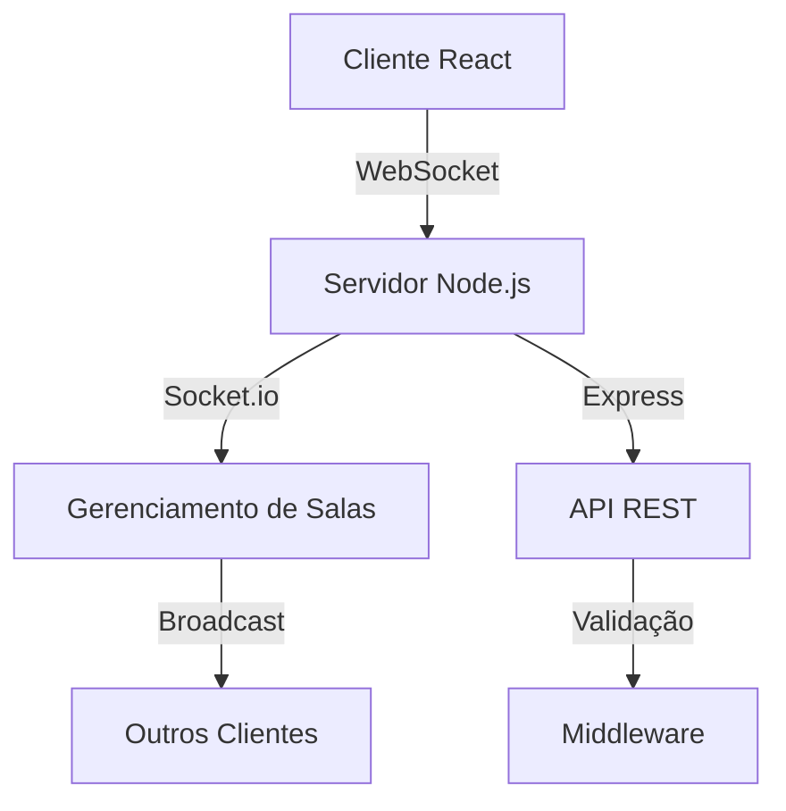

# 💬 Chat RealTime

<div align="center">


**Uma aplicação de chat em tempo real construída com Node.js, React e Socket.io**

[🚀 Demo](#-demonstração) • [📋 Funcionalidades](#-funcionalidades) • [🛠️ Instalação](#️-instalação) • [📖 Uso](#-uso) • [🤝 Contribuição](#-contribuição)

</div>

---

## 📋 Sobre o Projeto

O **Chat RealTime** é uma aplicação web moderna que permite comunicação em tempo real entre usuários através de salas de chat. Desenvolvido com as melhores práticas de 2025, oferece uma experiência fluida e responsiva para comunicação instantânea.

### 🎯 Objetivo

Criar uma plataforma de chat escalável que suporte múltiplas salas, notificações em tempo real e uma interface intuitiva, demonstrando o uso de WebSockets e padrões de design modernos.

---

## ✨ Funcionalidades

### 🔥 Principais
- [x] **Chat em tempo real** com WebSockets
- [x] **Múltiplas salas** de conversação
- [x] **Notificações** de entrada/saída de usuários
- [x] **Interface responsiva** e moderna
- [x] **Validação de usuários** únicos por sala
- [x] **Scroll automático** para novas mensagens

### 🛡️ Recursos Técnicos
- [x] **Arquitetura RESTful** no backend
- [x] **Padrão Observer** implementado
- [x] **CORS** configurado
- [x] **Tratamento de erros** robusto
- [x] **Testes automatizados** com Jest
- [x] **Hot reload** em desenvolvimento

---

## 🚀 Demonstração

### 📱 Interface do Usuário

<div align="center">

| Tela de Login | Chat em Ação |
|:---:|:---:|
|  |  |

</div>

### 🎬 Como Funciona

1. **Login**: Usuário insere nome, email, data de nascimento e nome da sala
2. **Conecta**: Sistema valida dados e conecta via WebSocket
3. **Chat**: Comunicação em tempo real com outros usuários da mesma sala
4. **Notificações**: Alertas quando usuários entram/saem da sala

---

## 🛠️ Instalação

### 📋 Pré-requisitos

- **Node.js** >= 18.12.0
- **npm** >= 8.19.2
- **Git** para clonagem do repositório

### 🔧 Instalação Passo a Passo

```bash
# 1. Clone o repositório
git clone https://github.com/seu-usuario/chat-realTime.git
cd chat-realTime

# 2. Instale as dependências do backend
cd back-end
npm install

# 3. Instale as dependências do frontend
cd ../front-end
npm install

# 4. Volte para a raiz do projeto
cd ..
```

---

## 🚀 Uso

### 🖥️ Executando o Projeto

```bash
# Terminal 1 - Backend (Porta 3000)
cd back-end
npm run dev

# Terminal 2 - Frontend (Porta 3001)
cd front-end
npm start
```

### 🧪 Testando o Chat

1. **Acesse** `http://localhost:3001`
2. **Preencha** os dados de login:
   - Nome
   - Email
   - Data de nascimento
   - Nome da sala
3. **Abra** uma nova aba/janela
4. **Entre** na mesma sala com outro usuário
5. **Comece** a conversar! 🎉

### 🧪 Executando Testes

```bash
# Backend
cd back-end
npm test
npm run test:coverage

# Frontend
cd front-end
npm test
```

---

## 🏗️ Arquitetura

### 📁 Estrutura do Projeto

```
chat-realTime/
├── 📁 back-end/                 # Servidor Node.js
│   ├── 📁 src/
│   │   ├── 📁 config/          # Configurações (DB, Socket, Server)
│   │   ├── 📁 controllers/     # Lógica de negócio
│   │   ├── 📁 middleware/      # Middlewares (CORS, Error Handler)
│   │   ├── 📁 models/          # Modelos de dados
│   │   ├── 📁 routes/          # Rotas da API
│   │   ├── 📁 services/        # Serviços (Socket)
│   │   └── 📁 utils/           # Utilitários
│   ├── 📄 app.js               # Ponto de entrada
│   └── 📄 package.json
├── 📁 front-end/               # Cliente React
│   ├── 📁 src/
│   │   ├── 📁 components/      # Componentes React
│   │   ├── 📁 assets/          # Imagens e recursos
│   │   └── 📄 App.js           # Componente principal
│   └── 📄 package.json
└── 📄 README.md
```

### 🔄 Fluxo de Dados



---

## 🛠️ Tecnologias

### 🎯 Backend
- **Node.js** - Runtime JavaScript
- **Express.js** - Framework web
- **Socket.io** - WebSockets em tempo real
- **Jest** - Framework de testes
- **CORS** - Cross-Origin Resource Sharing
- **UUID** - Geração de identificadores únicos

### 🎨 Frontend
- **React 18** - Biblioteca de interface
- **Socket.io Client** - Cliente WebSocket
- **React Testing Library** - Testes de componentes
- **React Scroll to Bottom** - Scroll automático

### 🔧 Ferramentas de Desenvolvimento
- **Nodemon** - Hot reload do servidor
- **Babel** - Transpilação JavaScript
- **ESLint** - Linting de código
- **Prettier** - Formatação de código

---

## 🧪 Testes

### 📊 Cobertura de Testes

```bash
# Executar todos os testes
npm run test

# Testes com cobertura
npm run test:coverage

# Testes em modo watch
npm run test:watch
```

### 🎯 Tipos de Teste

- **Unitários**: Funções e componentes isolados
- **Integração**: APIs e fluxos completos
- **E2E**: Cenários de usuário completos

---

## 🚀 Deploy

### 🌐 Produção

```bash
# Build do frontend
cd front-end
npm run build

# Iniciar servidor de produção
cd ../back-end
npm start
```

### 🐳 Docker (Opcional)

```dockerfile
# Dockerfile exemplo
FROM node:18-alpine
WORKDIR /app
COPY package*.json ./
RUN npm ci --only=production
COPY . .
EXPOSE 3000
CMD ["npm", "start"]
```

---

## 🤝 Contribuição

### 📝 Como Contribuir

1. **Fork** o projeto
2. **Crie** uma branch para sua feature (`git checkout -b feature/AmazingFeature`)
3. **Commit** suas mudanças (`git commit -m 'Add some AmazingFeature'`)
4. **Push** para a branch (`git push origin feature/AmazingFeature`)
5. **Abra** um Pull Request

### 📋 Padrões de Código

- **ESLint** configurado para JavaScript
- **Prettier** para formatação
- **Conventional Commits** para mensagens
- **Testes** obrigatórios para novas features

### 🐛 Reportando Bugs

Use o [sistema de issues](https://github.com/seu-usuario/chat-realTime/issues) para reportar bugs ou sugerir melhorias.

---

## 📄 Licença

Este projeto está sob a licença MIT. Veja o arquivo [LICENSE](LICENSE) para mais detalhes.

---

## 👥 Autores

- **Seu Nome** - *Desenvolvimento inicial* - [@seu-usuario](https://github.com/seu-usuario)

---

## 🙏 Agradecimentos

- Comunidade **Node.js** e **React**
- **Socket.io** pela excelente documentação
- Todos os **contribuidores** do projeto

---

<div align="center">

**⭐ Se este projeto te ajudou, considere dar uma estrela! ⭐**

[🔝 Voltar ao topo](#-chat-realtime)

</div>