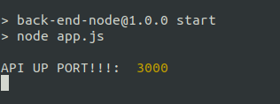
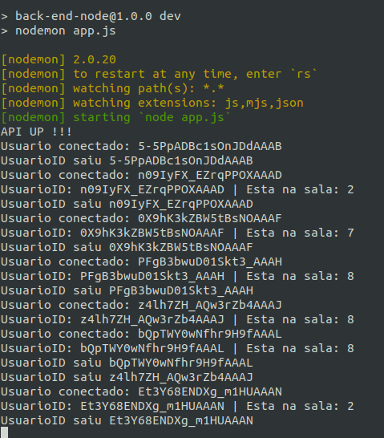

<h1 align="center">
    <a href="#" alt="">Back-end da aplicação usando Node.js</a>
</h1>

<h4 align="center">
	🚧 finalizado 🚧
</h4>

<p align="center">
 <a href="#funcionalidades">Funcionalidades</a> • 
 <a href="#layout">Layout</a> • 
 <a href="#pré-requisitos">Pré-requisitos</a> •
 <a href="#rodando-o-projeto">Rodando o projeto</a> •
 <a href="#tecnologias">Tecnologias</a> •
 <a href="#anexos">Anexos</a>
</p>


### Funcionalidades 

- [x] chat em tempo real
- [x] back-end em node.js

---
## Layout

O layout da aplicação:

<p align="center" style="display: flex; align-items: flex-start; justify-content: center;">
  
</p>

<p align="center" style="display: flex; align-items: flex-start; justify-content: center;">
  
</p>

---

### Pré-requisitos
    - ter ide para codificar
    - noções de node
    - browser ou postman
    - noções de git
    - noções de clear code
    - noções de design pattern

### Rodando o projeto

```bash
1 - clone repositorio do github
2 - ter node instalado 

 *subindo back-end:
 1 - ter node instalado 
 2 - intalando as dependencies na pasta back-end e nela use o comando 'npm install'
 3 - start no back-end para verificar se algo de errado 'npm run start'
 4 - abrir no navegador em 'http://localhost:3000'

 obs: para desenvolvimento sugiro, start no back-end para verificar se algo de errado 'npm run dev'


```

---
## Tecnologias do projeto

As principais foram usadas na construção do projeto:
 
```bash

    "dotenv": "^16.0.3", //lida com variavel de ambiente
    "express": "~4.18.2", //criar um servidor http
    "node": "v18.12.0", //back end da aplicação
    "nodemon": "^2.0.20", //restar a aplicação a cada mudança
    "npm": "8.19.2" //gerecia pacotes do node
    "browser" //ver as requisições
    "socket.io-client": "^4.5.4",// comunicação e montagem do chat

```

## Anexos

Documentos para auxiliar no projeto:

```bash

 Criando conexão de socket, um ​​socket é um ponto final de um link
 de comunicação bidirecional entre na mesma rede. 
 
 Com um endpoint é uma combinação de um endereço IP e 
 número de porta torna um chat em tempo real.

 Dica: sobre socket.io
 1 - Para emitir um evento do seu cliente, use a função “emit” no objeto socket
 2 - Para lidar com esses eventos, use a função “on” no	no objeto socket
 3 - Criar um evento NEW_MESSAGE ele será usado para envia mensagens do lado do cliente.
 4 - Ouça NEW_MESSAGE para receber novas mensagens

 - Sempre que for debbugar inicialize o projeto com 'npm run dev'

```


