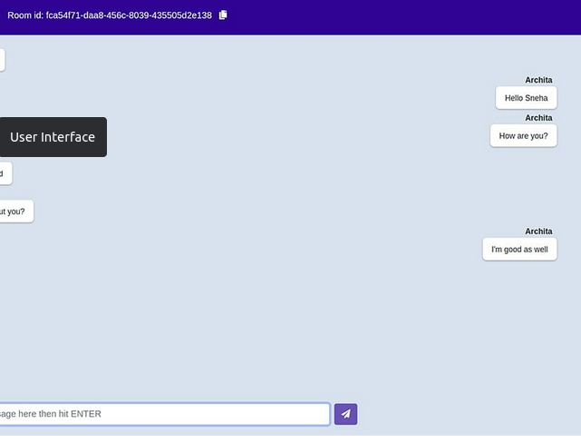

<h1 align="center">
    <a href="#" alt="">Front-end da aplicação usando React.js</a>
</h1>

<h4 align="center">
	🚧 finalizado 🚧
</h4>

<p align="center">
 <a href="#funcionalidades">Funcionalidades</a> • 
 <a href="#layout">Layout</a> • 
 <a href="#pré-requisitos">Pré-requisitos</a> •
 <a href="#rodando-o-projeto">Rodando o projeto</a> •
 <a href="#tecnologias">Tecnologias</a> •
 <a href="#anexos">Anexos</a>
</p>


### Funcionalidades 

- [x] chat em tempo real
- [x] front-end em react.js

---
## Layout

O layout da aplicação:

<p align="center" style="display: flex; align-items: flex-start; justify-content: center;">
  
</p>

---

### Pré-requisitos
    - ter ide para codificar
    - noções de react
    - noções de git
    - noções de clear code
    - noções de design pattern

### Rodando o projeto

```bash

1 - clone repositorio do github
2 - ter react instalado

 *subindo front-end:
 1 - ter react instalado 
 2 - ter a certeza que back-end esta funcioado sem erros
 3 - intalando as dependencies na pasta front-end e nela use o comando 'npm install'
 4 - start no back-end para verificar se algo de errado 'npm run start'
 5 - após isso o react pergunta se quer abrir o app usando outra porta,
 pois a '3000' está sendo usada pelo back-end coloque sim 
 6 - se tudo estiver ok projeto vai iniciar sozinho na url 'http://localhost:3000'
 7 - no projeto ele pedirá: nome, email, data de nascimento e nome da sala 

 **entrando em uma sala e iniciando. uma conversa
 1 - com aplicação na ok na na url 'http://localhost:3000'
 2 - abra outra janela na url 'http://localhost:3000'
 3 - no projeto ele pedirá: nome, email, data de nascimento e nome da sala, 
 no nome da sala coloque a que esta o usuário que iniciou o projeto
 4 - mande uma mensagem para e ele a voce se tudo estiver ok, ocorre a conversa 

 obs: para conversa ocorrer tem estar 
 1 - back-end ok
 2 - front-end ok
 3 - duas abas abertas por exemplo 'http://localhost:3000'
 4 - durante o cadastro os usuário colocarem a mesma sala  

```

---
## Tecnologias do projeto

As principais foram usadas na construção do projeto:
 
```bash

    "@testing-library/jest-dom": "^5.16.5", //
    "@testing-library/react": "^13.4.0", //
    "@testing-library/user-event": "^14.4.3", //
    "react": "^18.2.0", // 
    "react-dom": "^18.2.0", //
    "react-scripts": "5.0.1", //
    "react-scroll-to-bottom": "^4.2.0", //
    "socket.io-client": "^4.5.4", //
    "web-vitals": "^3.1.0" //

```

## Anexos

Documentos para auxiliar no projeto:

```bash

 - Sempre que for debbugar inicialize o projeto em package.json, 
 clique depurar e escolha a opção 'start'

```

