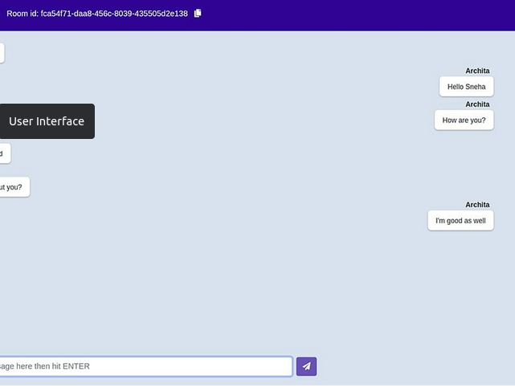

<h1 align="center">
    <a href="#" alt="">Front-end da aplicação usando React.js</a>
</h1>

<h4 align="center">
	🚧 finalizado 🚧
</h4>

<p align="center">
 <a href="#funcionalidades">Funcionalidades</a> • 
 <a href="#layout">Layout</a> • 
 <a href="#pré-requisitos">Pré-requisitos</a> •
 <a href="#rodando-o-projeto">Rodando o projeto</a> •
 <a href="#tecnologias">Tecnologias</a> •
 <a href="#anexos">Anexos</a>
</p>


### Funcionalidades 

- [x] chat em tempo real
- [x] back-end em react.js

---
## Layout

O layout da aplicação:

<p align="center" style="display: flex; align-items: flex-start; justify-content: center;">
  
</p>

---

### Pré-requisitos
    - ter ide para codificar
    - noções de react
    - browser ou postman
    - noções de react
    - noções de git
    - noções de clear code
    - noções de design pattern

### Rodando o projeto

```bash
1 - clone repositorio do github
2 - ter react instalado na maquina

 *subindo back-end:
 1 - ter react instalado 
 2 - ter a certeza que back-end esta funcioado sem erros
 3 - intalando as dependencies na pasta front-end e nela use o comando 'npm install'
 4 - start no back-end para verificar se algo de errado 'npm run start'


```

---
## Tecnologias do projeto

As principais foram usadas na construção do projeto:
 
```bash
    "axios": "^1.2.2",
    "bootstrap": "^5.2.3",
    "emoji-mart": "^5.4.0",
    "react": "^18.2.0",
    "react-dom": "^18.2.0",
    "react-router-dom": "^6.6.1",
    "react-scripts": "5.0.1",
    "react-toastify": "^9.1.1",
    "reactstrap": "^9.1.5",
    "sass": "^1.57.1",
    "socket.io-client": "^4.5.4",
    "stylesheet": "^0.9.1",
    "web-vitals": "^2.1.4"
```

## Anexos

Documentos para auxiliar no projeto:

```bash

 - Sempre que for debbugar inicialize o projeto em package.json, clique depurar e 
 escolha a opção 'start'

```

